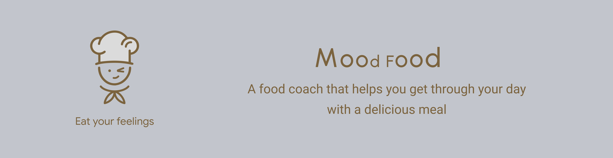
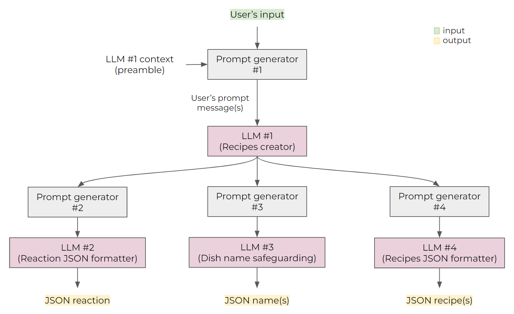

# LLM Demo - Mood Food



Mood Food is a chatbot-based web application that can create a recipe based on the user's message. It is powered by PaLM, a large language model from Google. To use Mood Food, simply type in a message describing your mood or what you're in the mood for, and Mood Food will generate a recipe that matches your request.

Mood Food is a great way to find new recipes to try, and it's also a fun way to explore different cuisines and ingredients.

Swiggy, an Indian online food ordering and delivery platform, expressed their excitement when considering the use cases made possible by experiences like MoodFood.

**“We're excited about the potential of Generative AI to transform the way we interact with our customers and merchants on our platform. Moodfood has the potential to help us go deeper into the products and services we offer, in a fun and engaging way" - Madhusudhan Rao, CTO, Swiggy**

Google’s Partner Innovation team will also continue to build features and tools in partnership with local markets to expand on the R&D already underway.


## Table of contents

- [LLM Demo - Mood Food](#llm-demo---mood-food)
  - [Table of contents](#table-of-contents)
  - [How to install](#how-to-install)
    - [Install node modules](#install-node-modules)
    - [Edit environment variables](#edit-environment-variables)
    - [Develop](#develop)
    - [Build](#build)
    - [How to host a static website on Google App Engine.](#how-to-host-a-static-website-on-google-app-engine)
  - [How it works](#how-it-works)
    - [LLM's prompt design](#llms-prompt-design)
    - [Prompt generator #1](#prompt-generator-1)
    - [Prompt generator #2](#prompt-generator-2)
    - [Prompt generator #3](#prompt-generator-3)
    - [Prompt generator #4](#prompt-generator-4)
    - [LLM's response](#llms-response)

## How to install

### Install node modules

```bash
yarn
```

### Edit environment variables

Make sure you have the following environment variables set in the `.env` file:

```bash
VITE_GOOGLE_GENERATIVE_LANGUAGE_API_KEY=<YOUR_GOOGLE_GENERATIVE_LANGUAGE_API_KEY>
```

### Develop

```bash
yarn dev
```

### Build

```bash
yarn build
```

### How to host a static website on Google App Engine.

https://cloud.google.com/appengine/docs/legacy/standard/python/getting-started/hosting-a-static-website

## How it works

### LLM's prompt design



### Prompt generator #1

In the user's first turn, the user's input message `${msg}` will be formatted into this structure:

```js
{
    author: '0',
    content: `Hello!, the message is "${msg}". Answer the recipe in the format I provided. Do not include any words related to politics, religion, or race.`
}
```

In the user's subsequent turns, the user's input message `${msg}` will be formatted into this structure:

```js
{
    author: '0',
    content: `"${msg}". Answer the recipe in the format I provided. Do not include any words related to politics, religion, or race.`
}
```

Here is the final structure of the prompt sending to the LLM #1:

```js
{
    prompt: {
        context: `I want you to act as a very creative chef who is an expert in foods and ingredients. In every user's message, you have to come up with an unimaginable recipe based on the user's message and any specific interests or preferences they may have. There can be more than one recipe based on the user's message. Answer in markdown format that includes only the following sections: "reaction", "name", "ingredients", "instructions", and "description". The "reaction" should be your humorous response to the user's message in a polite way. The "name" should be a possible name that plays with polite puns and does not offend anyone. The "ingredients" section should be a list of ingredients with their measurements. The "instructions" section should be a step-by-step guide on how to cook the recipe. The "description" should be the food description introduced by you as the funny chef. Do not include "variations" and "tips". Do not use the user's hated ingredients in the recipe. When the user asks for changing the ingredients, please make an update to the latest recipe`,
        messages: [
            {
                author: '0',
                content: `Hello!, the message is "${msg}". Answer the recipe in the format I provided. Do not include any words related to politics, religion, or race.`
            },
            ...
        ]
    },
    temperature: 0.75,
    candidate_count: 1,
}
```

- The `context` is the context of the conversation. It is used to give the LLM a better understanding of the conversation.
- The `messages` is an array of chat messages from past to present alternating between the user (author=0) and the LLM (author=1). The first message is always from the user.
- The `temperature` is a float number between 0 and 1. The higher the temperature, the more creative the response will be. The lower the temperature, the more likely the response will be a correct one.
- The `candidate_count` is the number of responses that the LLM will return.

### Prompt generator #2

This is for LLM #2 (Reaction JSON formatter). It will be used as a subsequent call to LLM #1. In every user's turn, the user's input message and the result from LLM #1 will be formatted into this structure and send to the LLM #2:

````js
{
    prompt: {
        messages: [
            {
                author: '0',
                content: <the_latest_user_msg_llm_1>
            },
            {
                author: '1',
                content: <the_latest_llm_1_response>
            },
            {
                author: '0',
    content: 'Rewrite only the "Reaction" response into this JSON format: ```{"reaction":string}```'
            }
        ]
    },
    temperature: 0.0,
    candidate_count: 1
}
````

- The `messages` is an array of the latest user-LLM conversation pair concatenated with the author-0 message asking for reaction JSON formatting.

### Prompt generator #3

This is for LLM #3 (Dish name safeguarding). It will be used as a subsequent call to LLM #1. In every user's turn, the user's input message and the result from LLM #1 will be formatted into this structure and send to the LLM #3:

````js
{
    prompt: {
        messages: [
            {
                author: '0',
                content: <the_latest_user_msg_llm_1>
            },
            {
                author: '1',
                content: <the_latest_llm_1_response>
            },
            {
                author: '0',
    content: 'Rewrite only the "Name" response into this JSON format: ```{"recipes":[{"name":string},{...}]}```. Make sure that there are no words related to politics, religion, or race.'
            }
        ]
    },
    temperature: 0.1,
    candidate_count: 1
}
````

- The `messages` is an array of the latest user-LLM conversation pair concatenated with the author-0 message asking for dish name safeguarding JSON formatting.

### Prompt generator #4

This is for LLM #4 (Recipes JSON formatter). It will be used as a subsequent call to LLM #1. In every user's turn, the user's input message and the result from LLM #1 will be formatted into this structure and send to the LLM #4:

````js
{
    prompt: {
        messages: [
            {
                author: '0',
                content: <the_latest_user_msg_llm_1>
            },
            {
                author: '1',
                content: <the_latest_llm_1_response>
            },
            {
                author: '0',
    content: 'You have to rewrite your response into this JSON format: ```{"recipes":[{"name":string,"course":string,"ingredients":[]string,"instructions":[]string,"description":string},...,{...}]}```'
            }
        ]
    },
    temperature: 0.0,
    candidate_count: 1
}
````

- The `messages` is an array of the latest user-LLM conversation pair concatenated with the author-0 message asking for recipes JSON formatting.

### LLM's response

The output of the LLM is in this structure:

```js
{
    candidates: [
        {
            author: '1',
            content: 'This is the response content from the LLM.'
        }
    ],
    messages: [
        ...
    ]
}
```

- The `candidates` is an array of responses from the LLM. This project has only one response per turn (as candidate_count=1).
- The `messages` is an array of chat messages from past to present alternating between the user (author=0) and the LLM (author=1). The first message is always from the user.
