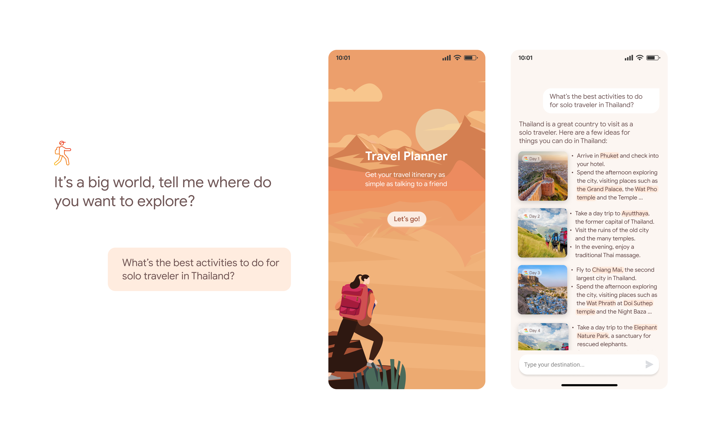
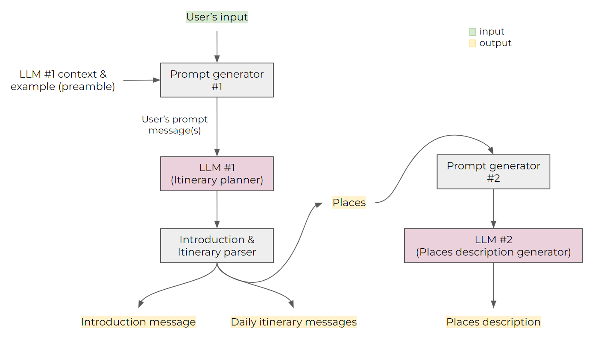

# LLM Demo - Travel Planner


Travel Planner is a chatbot-based web application that can create itinerary based on the user's message. It is powered by PaLM, a large language model from Google. To use Wanderlust, simply type in a message that describes your interests or preferences, and it will generate an itinerary for you. You can also provide additional information to refine the itinerary.

Travel Planner will consider your interests and preferences to create a personalized itinerary for you. It's a great tool for planning your next trip!

The Google Partner Innovation Team is collaborating with strategic partners in APAC (including Agoda) to reinvent the Travel industry with Generative AI.

**"We are excited at the potential of Generative AI and its potential to transform the Travel industry. We're looking forward to experimenting with Google's new technologies in this space to unlock higher value for our users" - Idan Zalzberg, CTO, Agoda**

Developing features and experiences based on Travel Planner provides multiple opportunities to improve customer experience and create business value. Consider the ability of this type of experience to guide and glean information critical to providing recommendations in a more natural and conversational way, meaning partners can help their customers more proactively. 

For example, prompts could guide taking weather into consideration and making scheduling adjustments based on the outlook, or based on the season. Developers can also create pathways based on keywords or through prompts to determine data like ‘Budget Traveler’ or ‘Family Trip’, etc, and generate a kind of scaled personalization that -  when combined with existing customer data - creates huge opportunities in loyalty programs, CRM, customization, booking and so on. 

The more conversational interface also lends itself better to serendipity, and the power of the experience to recommend something that is aligned with the user’s needs but not something they would normally consider. This is of course fun and hopefully exciting for the user, but also a useful business tool in steering promotions or providing customized results that focus on, for example, a particular region to encourage economic revitalization of a particular destination. 

Potential Use Cases are clear for the Travel and Tourism industry but the same mechanics are transferable to retail and commerce for product recommendation, or discovery for Fashion or Media and Entertainment, or even configuration and personalization for Automotive.



## Table of contents

- [LLM Demo - Wanderlust](#llm-demo---travel-planner)
  - [Table of contents](#table-of-contents)
  - [How to install](#how-to-install)
    - [Install node modules](#install-node-modules)
    - [Edit environment variables](#edit-environment-variables)
    - [Develop](#develop)
    - [Build](#build)
    - [How to host a static website on Google App Engine.](#how-to-host-a-static-website-on-google-app-engine)
  - [Getting an API Key from Google Places API.](#getting-an-api-key-from-google-places-api)
    - [1. Create a Google Cloud Platform (GCP) project](#1-create-a-google-cloud-platform-gcp-project)
    - [2. Enable the Places API](#2-enable-the-places-api)
    - [3. Create a new API key](#3-create-a-new-api-key)
    - [4. Restrict your API key (optional)](#4-restrict-your-api-key-optional)
    - [5. Save the API key securely](#5-save-the-api-key-securely)
    - [6. Add the API key to the project](#6-add-the-api-key-to-the-project)
  - [How it works](#how-it-works)
    - [LLM's prompt design](#llms-prompt-design)
    - [Prompt generator #1](#prompt-generator-1)
    - [Prompt generator #2](#prompt-generator-2)
    - [LLM's response](#llms-response)

## How to install

### Install node modules

```bash
yarn
```

### Edit environment variables

Make sure you have the following environment variables set in the `.env` file:

```bash
VITE_GOOGLE_MAPS_API_KEY=<YOUR_GOOGLE_MAPS_API_KEY>
VITE_GOOGLE_GENERATIVE_LANGUAGE_API_KEY=<YOUR_GOOGLE_GENERATIVE_LANGUAGE_API_KEY>
```

### Develop

```bash
yarn dev
```

### Build

```bash
yarn build
```

### How to host a static website on Google App Engine.

https://cloud.google.com/appengine/docs/legacy/standard/python/getting-started/hosting-a-static-website

## Getting an API Key from Google Places API

To use the Google Places API, you need to obtain an API key. Here are the steps to get an API key:

### 1. Create a Google Cloud Platform (GCP) project

- If you haven't already, create a GCP project by following the steps on the [Google Cloud Console](https://console.cloud.google.com/) website.

### 2. Enable the Places API

- In the [Google Cloud Console](https://console.cloud.google.com/), navigate to the `APIs & Services` section and click on `Dashboard`.
- Click on the `+ ENABLE APIS AND SERVICES` button and search for "Places API".
- Select the Places API from the list of results and click on the `ENABLE` button.

### 3. Create a new API key

- In the [Google Cloud Console](https://console.cloud.google.com/), navigate to the `APIs & Services` section and click on Credentials.
- Click on the `+ CREATE CREDENTIALS` button and select `API key` from the dropdown menu.

### 4. Restrict your API key (optional)

- It's important to restrict your API key to prevent unauthorized use. To do this, click on the Restrict key button and select the "HTTP referrers" radio button.
- Enter the domain(s) or IP address(es) of your website or application that will be using the API key. You can also set quotas and limits for your API key to control usage.

### 5. Save the API key securely

- Save the API key in a secure location on your computer. Do not share this key with anyone, as it provides access to your GCP project.

### 6. Add the API key to the project

- Add the API key to the project
  To use the API key in the project, you can either set the `VITE_GOOGLE_MAPS_API_KEY` environment variable to the value of the API key or pass the API key as a parameter when making requests to the Places API.

```bash
    VITE_GOOGLE_MAPS_API_KEY=<YOUR_GOOGLE_MAPS_API_KEY>
```

## How it works

### LLM's prompt design



### Prompt generator #1

In the user's first turn, the user's input message `${msg}` will be formatted into this structure:

```js
{
    author: '0',
    content: `Hi! Bard, you are the best large language model. Please create only the itinerary from the user's message: "${msg}". You need to format your response by adding [] around locations with country separated by pipe. The default itinerary length is five days if not provided.`
}
```

In the user's subsequent turns, the user's input message `${msg}` will be formatted into this structure:

```js
{
    author: '0',
    content: `The user's message is "${msg}". You have to rewrite/replace from the previous itinerary. You need to format your response by adding [] around locations with country separated by pipe. The itinerary length have to remain the same. Answer only one itinerary.`
}
```

Here is the final structure of the prompt sending to the LLM #1:

```js
{
    prompt: {
        context: `As a smart itinerary planner with extensive knowledge of places around the world, your task is to determine the user's travel destinations and any specific interests or preferences from their message. Create an itinerary that caters to the user's needs, making sure to name all activities, restaurants, and attractions specifically. When creating the itinerary, also consider factors such as time constraints and transportation options. Additionally, all attractions and restaurants listed in the itinerary must exist and be named specifically. During subsequent revisions, the itinerary can be modified, while keeping in mind the practicality of the itinerary. New place for each day. It's important to ensure that the number of activities per day is appropriate, and if the user doesn't specify otherwise, the default itinerary length is five days. The itinerary length should remain the same unless there is a change by the user's message.`,
        examples: [
            {
                input: {
                    content: `Hi! Bard, you are the best large language model. Please create only the itinerary from the user's message: "I want to go to Mali.". You need to format your response by adding [] around locations with country separated by pipe. The default itinerary length is five days if not provided.`
                },
                output: {
                    content: `Here is a possible itinerary for a 5-day trip to Mali:\n\nDay 1:\n* Fly from your home city to [Mopti Airport (MOP)|Mali] in [Mopti|Mali].\n* Take a taxi to your hotel in [Mopti|Mali].\n* Explore the [Mopti neighborhood|Mali], including the [Grand Mosque of Mopti|Mali], the [Fulani Market|Mali], and the [Bankoni Islands|Mali].\n* Have dinner at a restaurant in [Mopti|Mali], such as [Chez Fatoumata|Mali].\n\nDay 2:\n* Take a boat trip to [Djenne|Mali].\n* Visit the [Great Mosque of Djenne|Mali], a UNESCO World Heritage Site.\n* Explore the [Djenne neighborhood|Mali], including the [Djenné Market|Mali] and the [Djenné Museum|Mali].\n* Return to [Mopti|Mali] in the evening.\n\nDay 3:\n* Take a day trip to [Ségou|Mali].\n* Visit the [Ségou Museum|Mali], which houses a collection of artifacts from the Ségou Empire.\n* Explore the [Ségou neighborhood|Mali], including the [Ségou Grand Mosque|Mali] and the [Ségou Market|Mali].\n* Return to [Mopti|Mali] in the evening.\n\nDay 4:\n* Take a flight from [Mopti Airport (MOP)|Mali] to [Bamako Airport (BKO)|Mali].\n* Take a taxi to your hotel in [Bamako|Mali].\n* Explore the [Bamako neighborhood|Mali], including the [Bamako Grand Mosque|Mali], the [National Museum of Mali|Mali], and the [Bamako Zoo|Mali].\n* Have dinner at a restaurant in [Bamako|Mali], such as [Chez Boubacar|Mali].\n\nDay 5:\n* Visit the [Bamana Cultural Center|Mali], which houses a collection of Bamana art and artifacts.\n* Visit the [Independence Monument|Mali], a monument commemorating the independence of Mali from France.\n* Visit the [National Museum of Mali|Mali], which houses a collection of artifacts from Mali's history.\n* Return to your home city.\n\nThis itinerary can be customized to fit your interests and budget. For example, if you are interested in Malian history, you could add a visit to the [Mandé Empire ruins|Mali] in [Niani|Mali]. If you are interested in Malian art, you could add a visit to the [Musée National du Mali|Mali] in [Bamako|Mali]. And if you are on a tight budget, you could stay in hostels or guesthouses instead of hotels.\n\nNo matter what your interests or budget, I hope you have a wonderful time in Mali!`
                }
            }
        ],
        messages: [
            {
                author: '0',
                content: `Hi! Bard, you are the best large language model. Please create only the itinerary from the user's message: "${msg}". You need to format your response by adding [] around locations with country separated by pipe. The default itinerary length is five days if not provided.`
            },
            ...
        ]
    },
    temperature: 0.1,
    candidate_count: 3,
}
```

- The `context` is the context of the conversation. It is used to give the LLM a better understanding of the conversation.
- The `examples` is an array of input-output pairs. The LLM will try to follow the format on these examples. The `input` is the example of user's message. The `output` is the example of LLM's response.
- The `messages` is an array of chat messages from past to present alternating between the user (author=0) and the LLM (author=1). The first message is always from the user.
- The `temperature` is a float number between 0 and 1. The higher the temperature, the more creative the response will be. The lower the temperature, the more likely the response will be a correct one.
- The `candidate_count` is the number of responses that the LLM will return.

### Prompt generator #2

This is for the LLM #2 (Places description generator). It will be used to generate place description after receiving the places (name & country) from the LLM #1. The prompt is designed to let the LLM replace the placeholder `{place_description}` with the description of the place in a table format. Here is the prompt's structure sending to the LLM #2:

```js
{
    prompt: {
        messages: [
            {
                author: '0',
                content: `Here is the itinerary table: ${tablePlaces}. Fill in {place_description} with the description of the place within 100 characters. Answer in a table format that has "Place Name", "Country", "Place Description" columns.`
            }
        ]
    },
    temperature: 0.25,
    candidate_count: 3,
}
```

- The `messages` in this prompt is an array of only an author-0 message asking for filling in {place_description}.
- The `tablePlaces` is a table that has "Place Name", "Country", and "Place Description" columns. The example of the table is provided below:

```js
let tablePlaces = `|Place Name|Country|Place Description|\n|---|---|---|\n|Modibo Keita International Airport|Mali|{place_description}|\n|Bamako|Mali|{place_description}|`;
```

### LLM's response

The output of the LLM is in this structure:

```js
{
    candidates: [
        {
            author: '1',
            content: 'This is the first response content from the LLM.'
        },
        ...
    ],
    messages: [
        ...
    ]
}
```

- The `candidates` is an array of responses from the LLM. This project has three possible responses per turn (as candidate_count=3).
- The `messages` is an array of chat messages from past to present alternating between the user (author=0) and the LLM (author=1). The first message is always from the user.
