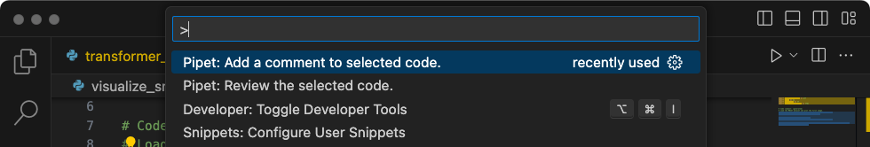

# Pipet Code Agent

Pipet Code Agent is an AI-powered code assistance tool, built as an extension
for Microsoft [Visual Studio Code](https://code.visualstudio.com/) (VS Code).
Pipet uses the Google Gemini API to help you write code comments and review your
code by adding commands to the command pallete of VS Code.

Pipet is provided as a development project, so you must configure and build
it if you want to run it in your VS Code instance. For more information
about building, configuring, running, and extending this project, see the
[Build AI Code Assistant with Pipet Code Agent](https://ai.google.dev/examples/pipet-code-agent) tutorial.

## Project setup

These instructions walk you through getting the Pipet Code Agent project set up
for development and testing. The general steps are Installing some prerequisite
software, setting a few environment variables, cloning the project from the code
repository, and running the configuration installation.

Note: You need a Google Gemini API Key to be able to run the project, which you
can obtain from the [Google Gemini API](https://ai.google.dev/tutorials/setup) page.

### Install the prerequisites

The Pipet Code Agent project runs as an extension of Microsoft [Visual Studio
Code](https://code.visualstudio.com/), and uses
[Node.js](https://nodejs.org/) and npm to manage packages and run the
application. The following installation instructions are for a Linux host
machine.

To install the required software:

1.  Install [Visual Studio Code](https://code.visualstudio.com/download)
    for your platform.
1.  Install `node` and `npm` by following the [installation
    instructions](https://nodejs.org/) for your platform.

### Clone and configure the project

Download the project code and use the `npm` installation command to download
the required dependencies and configure the project. You need
[git](https://git-scm.com/) source control software to retrieve
the project source code.

To download and configure the project code:

1.  Clone the git repository using the following command.\
    `git clone https://github.com/google/generative-ai-docs`
1.  Optionally, configure your local git repository to use sparse checkout,
so you have only the files for the Docs Agent project.\
    `cd generative-ai-docs/`\
    `git sparse-checkout init --cone`\
    `git sparse-checkout set examples/gemini/node/pipet-code-agent/`
1.  Navigate to the Pipet Code Agent project root directory.\
    `cd generative-ai-docs/examples/gemini/node/pipet-code-agent/`
1.  Run the install command to download dependencies and configure the project:\
    `npm install`

### Configure and test the extension

You should now be able to test your installation by running Pipet Code Agent as
a development extension in VS Code on your device. The test opens a separate VS
Code **Extension Development Host** window where the new extension is available.
In this new window, you configure the API Key the extension uses to access the
Google Gemini API.

To configure and test your setup:

1.  Start the VS Code application.
1.  In VS Code, create a new window by selecting **File > New Window**.
1.  Open the Pipet Code Agent project by selecting **File > Open Folder**,
    and selecting the `pipet-code-agent/` folder.
1.  Open the `pipet-code-agent/package.json` file.
1.  Run the extension in debug mode by selecting **Run > Start Debugging**.
    This step opens a separate VS Code **Extension Development Host** window.
1.  Open the VS Code settings by selecting **Code > Settings > Settings**.
1.  Get a [Google Gemini API Key](https://ai.google.dev/tutorials/setup)
    from the Generative AI Developer site, and copy the key string.
1.  Set the API key as a configuration setting. In **Search Settings**
    field, type `pipet`, select the **User** tab, and in the **Google > Gemini
    Api Key** setting, click the **Edit in settings.json** link, and add your
    Gemini API key:\
    `"google.gemini.apiKey": "your-api-key-here"`
1.  Save the changes to the `settings.json` file and close the settings tabs.

**Caution:** Treat your API Key like a password and protect it appropriately. Don't
embed your key in publicly published code.

To test the extension commands:

1.  In the VS Code **Extension Development Host** window, select some code
    in the editor window.
1.  Open the command palette by selecting **View > Command Palette**.
1.  In the Command Palette, type `Pipet` and select one of the commands with
    that prefix.

## Resources

- Project code tutorial:
[Build AI Code Assistant with Pipet Code Agent](https://ai.google.dev/examples/pipet-code-agent) tutorial.
