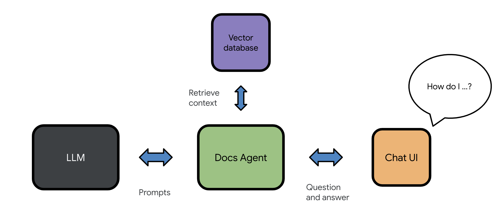

# Docs Agent

The Docs Agent project explores applications and use cases that involve using a large
corpus of documentation as a knowledge source for AI language models.

Docs Agent provides a set of easy-to-use self-service tools designed to give you and
your team access to Google's [Gemini API][genai-doc-site] for learning, experimentation,
and project deployment.

## Docs Agent web app

Docs Agent uses a technique known as **Retrieval Augmented Generation (RAG)**, which
allows you to bring your own documents as knowledge sources to AI language models.
This approach helps the AI language models to generate relevant and accurate responses
that are grounded in the information that you provide and control.



**Figure 1**. Docs Agent uses a vector database to retrieve context for augmenting prompts.

The Docs Agent chatbot web app is designed to be easily set up and configured in a Linux
environment. If you want to set up and launch the Docs Agent chat app on your host machine,
check out the [Set up Docs Agent][set-up-docs-agent] section below.

## Docs Agent tasks

Docs Agent's `agent runtask` command allows you to run pre-defined chains of prompts,
which are referred to as **tasks**. These tasks simplify complex interactions by defining
a series of steps that the Docs Agent CLI will execute. The tasks are defined in `.yaml`
files stored in the [`tasks`][tasks-dir] directory of your Docs Agent project. The tasks are
designed to be reusable and can be used to automate common workflows, such as generating
release notes, drafting overview pages, or analyzing complex information.

A task file example:

```yaml
tasks:
  - name: "ExtractWorkflows"
    model: "models/gemini-1.5-flash-latest"
    description: "An agent that extracts workflows from a source doc."
    steps:
      - prompt: "Summarize the contents of this document in a concise and informative manner. Focus on the key procedures, steps, or workflows described."
        flags:
          file: "<INPUT>"
          default_input: "./README.md"
      - prompt: "Identify and list all key workflows described in the document. Provide a brief description for each workflow, highlighting its purpose and key steps."
      - prompt: "Identify all command lines used in the workflows described in the document. Focus on command lines that are essential for executing the workflow steps."
      - prompt: "For each identified command line, provide a detailed description of its function and purpose. Include specific examples of its usage, showcasing how it is integrated within the workflows."
```

To set up and run the `agent runtask` command, see [Set up Docs Agent CLI][cli-readme].

## Summary of features

The list below summarizes the tasks and features supported by Docs Agent:

- **Process Markdown**: Split Markdown files into small plain text chunks. (See
  [Docs Agent chunking process][chunking-process].)
- **Generate embeddings**: Use an embedding model to process text chunks into embeddings
  and store them in a vector database.
- **Perform semantic search**: Compare embeddings in a vector database to retrieve
  chunks that are most relevant to user questions.
- **Add context to a user question**: Add chunks returned from a semantic search as
  [context][prompt-structure] to a prompt.
- **Fact-check responses**: This [experimental feature][fact-check-section] composes
  a follow-up prompt and asks the language model to “fact-check” its own previous response.
- **Generate related questions**: In addition to answering a question, Docs Agent can
  [suggest related questions][related-questions-section] based on the context of the
  question.
- **Return URLs of source documents**: URLs are stored as chunks' metadata. This enables
  Docs Agent to return the URLs of the source documents.
- **Collect feedback from users**: Docs Agent's web app has buttons that allow users
  to [like responses][like-generated-responses] or [submit rewrites][submit-a-rewrite].
- **Convert Google Docs, PDF, and Gmail into Markdown files**: This feature uses
  [Apps Script][apps-script-readme] to convert Google Docs, PDF, and Gmail into
  Markdown files, which then can be used as input datasets for Docs Agent.
- **Run benchmark test**: Docs Agent can [run benchmark test][benchmark-test] to measure
  and compare the quality of text chunks, embeddings, and AI-generated responses.
- **Use the Semantic Retrieval API and AQA model**: Docs Agent can use Gemini's
  [Semantic Retrieval API][semantic-api] to upload source documents to online corpora
  and use the [AQA model][aqa-model] for answering questions.
- **Manage online corpora using the Docs Agent CLI**: The [Docs Agent CLI][cli-reference]
  lets you create, update and delete online corpora using the Semantic Retrieval AI.
- **Prevent duplicate chunks and delete obsolete chunks in databases**: Docs Agent
  uses [metadata in chunks][chunking-process] to prevent uploading duplicate chunks
  and delete obsolete chunks that are no longer present in the source.
- **Run the Docs Agent CLI from anywhere in a terminal**:
  [Set up the Docs Agent CLI][cli-readme] to make requests to the Gemini models
  from anywhere in a terminal.
- **Support the Gemini 1.5 models**: Docs Agent works with the Gemini 1.5 models,
  `gemini-1.5-pro`, `gemini-1.5-flash`, and `text-embedding-004`. The new
  [`full`][new-15-mode] web app mode uses all three Gemini models to their strength:
  AQA (`aqa`), Gemini 1.0 Pro (`gemini-pro`), and Gemini 1.5 Pro (`gemini-1.5-pro`).
- **Complete a task using the Docs Agent CLI**: The `agent runtask` command allows you
  to run pre-defined chains of prompts, which are referred to as tasks. These tasks
  simplify complex interactions by defining a series of steps that the Docs Agent will
  execute. The tasks are defined in .yaml files stored in the [`tasks`][tasks-dir]
  directory of your Docs Agent project. To run a task in this directory, for example:

  ```sh
  agent runtask --task DraftReleaseNotes
  ```

- **Multi-modal support**: Docs Agent's `agent helpme` command can include image,
  audio, and video files as part of a prompt to the Gemini 1.5 model, for example:

  ```sh
  agent helpme Provide a concise, descriptive alt text for this PNG image --file ./my_image_example.png
  ```

  You can use this feature for creating tasks as well. For example, see the
  [DescribeImages][describe-images] task.

For more information on Docs Agent's architecture and features,
see the [Docs Agent concepts][docs-agent-concepts] page.


**Figure 2**. A screenshot of the Docs Agent chat app launched using Flutter docs.

## Set up Docs Agent

**Note**: For instructions on the Docs Agent CLI setup, see the
[`README.md`][cli-readme] file in the `docs_agent/interfaces` directory.

This section provides instructions on how to set up and launch the Docs Agent
chatbot web app on a Linux host machine.

### 1. Prerequisites

Setting up Docs Agent requires the following prerequisite items:

- A Linux host machine

- A [Google Cloud][google-cloud] project with the setup below:

  - An API key enabled with the Generative Language API (that is,
    the [Gemini API][genai-doc-site])

  - (**Optional**) [Authenticated OAuth client credentials][oauth-client]
    stored on the host machine

### 2 Update your host machine's environment

Update your host machine's environment to prepare for the Docs Agent setup:

1. Update the Linux package repositories on the host machine:

   ```
   sudo apt update
   ```

2. Install the following dependencies:

   ```
   sudo apt install git pipx python3-venv
   ```

3. Install `poetry`:

   ```
   pipx install poetry
   ```

4. To add `$HOME/.local/bin` to your `PATH` variable, run the following
   command:

   ```
   pipx ensurepath
   ```

5. To set the Google API key as a environment variable, add the following
   line to your `$HOME/.bashrc` file:

   ```
   export GOOGLE_API_KEY=<YOUR_API_KEY_HERE>
   ```

   Replace `<YOUR_API_KEY_HERE>` with the API key to the
   [Gemini API][genai-doc-site].

6. Update your environment:

   ```
   source ~/.bashrc
   ```

### 3. (Optional) Authorize credentials for Docs Agent

**This step is needed only if you plan to use [Gemini's AQA model][aqa-model-concept].**

Authorize Google Cloud credentials on your host machine:

1. Download the `client_secret.json` file from your
   [Google Cloud project][authorize-credentials].

2. Copy the `client_secret.json` file to your host machine.

3. Install the Google Cloud SDK on your host machine:

   ```
   sudo apt install google-cloud-sdk
   ```

4. To authenticate credentials, run the following command in the directory of
   the host machine where the `client_secret.json` file is located:

   ```
   gcloud auth application-default login --client-id-file=client_secret.json --scopes='https://www.googleapis.com/auth/cloud-platform,https://www.googleapis.com/auth/generative-language.retriever'
   ```

   This command opens a browser and asks to log in using your Google account.

5. Follow the instructions on the browser and click **Allow** to authenticate.

   This saves the authenticated credentials for Docs Agent
   (`application_default_credentials.json`) in the `$HOME/.config/gcloud/`
   directory of your host machine.

### 4. Clone the Docs Agent project

**Note**: This guide assumes that you're creating a new project directory
from your `$HOME` directory.

Clone the Docs Agent project and install dependencies:

1. Clone the following repo:

   ```
   git clone https://github.com/google/generative-ai-docs.git
   ```

2. Go to the Docs Agent project directory:

   ```
   cd generative-ai-docs/examples/gemini/python/docs-agent
   ```

3. Install dependencies using `poetry`:

   ```
   poetry install
   ```

4. Enter the `poetry` shell environment:

   ```
   poetry shell
   ```

   **Important**: From this point, all `agent` command lines below need to
   run in this `poetry shell` environment.

5. (**Optional**) To enable autocomplete commands and flags related to
   Docs Agent in your shell environment, run the following command:

   ```
   source scripts/autocomplete.sh
   ```

### 5. Edit the Docs Agent configuration file

This guide uses the [open source Flutter documents][flutter-docs-src] as an example dataset,
which are the source Markdown files for the [Flutter website][flutter-docs-site].

To complete this setup walkthrough, run the command below to download the open source
Flutter documents somewhere on your host machine (for instance, in your `$HOME` directory):

```
git clone --recurse-submodules https://github.com/flutter/website.git
```

Update settings in the Docs Agent project to use your custom dataset:

1. Go to the Docs Agent project home directory, for example:

   ```
   cd $HOME/generative-ai-docs/examples/gemini/python/docs-agent
   ```

2. Open the [`config.yaml`][config-yaml] file using a text editor, for example:

   ```
   nano config.yaml
   ```

3. Edit the file to update the `product_name` field, for example:

   ```
   product_name: "Flutter"
   ```

   This product name is displayed on the Docs Agent chat app UI.

4. Under the `inputs` field, define the following entries to specify the directories
   that contain your source Markdown files.

   - `path`: The directory where the source Markdown files are stored.
   - `url_prefix`: The prefix used to create URLs for the source Markdown files.

     **Important**: If URLs do not exist for your Markdown files, you still need to
     provide a placeholder string in the `url_prefix` field.

   The example below shows the entries for the Flutter documents downloaded in the
  `$HOME/website` directory):

   ```
   inputs:
     - path: "/usr/local/home/user01/website/src/content"
       url_prefix: "https://docs.flutter.dev"
   ```

   You can also provide multiple input directories (`path` and `url_prefix` sets) under
   the `inputs` field, for example:

   ```
   inputs:
     - path: "/usr/local/home/user01/website/src/content/ui"
       url_prefix: "https://docs.flutter.dev/ui"
     - path: "/usr/local/home/user01/website/src/content/tools"
       url_prefix: "https://docs.flutter.dev/tools"
   ```

6. If you want to use the `gemini-pro` model with a local vector database setup
   (`chroma`), use the following settings:

   ```
   models:
     - language_model: "models/gemini-pro"
   ...
   db_type: "chroma"
   ```

   (**Optional**) Or if you want to use the Gemini AQA model and populate
   a corpus online via the [Semantic Retrieval API][semantic-api], use the
   following settings (and update the `corpus_name` field):

   ```
   models:
     - language_model: "models/aqa"
   ...
   db_type: "google_semantic_retriever"
   db_configs:
     ...
     - db_type: "google_semantic_retriever"
       corpus_name: "corpora/flutter-dev"
   ```

7. Save the `config.yaml` file and exit the text editor.


### 6. Populate a new vector database

The Docs Agent CLI can help you chunk documents, generate embeddings extract metadata,
and populate a vector database from Markdown files and more.

**Note**: The `agent` commands below need to run within the `poetry shell` environment.

To populate a new vector database:

1. Go to the Docs Agent project home directory, for example:

   ```
   cd $HOME/generative-ai-docs/examples/gemini/python/docs-agent
   ```

2. Process Markdown files into small text chunks:

   ```
   agent chunk
   ```

   The command takes documents under the `inputs` fields (specified in your
   `config.yaml` file), splits the documents into small text chunk files, and
   stores them in the `output_path` direcoty.

3. Create and populate a new vector database:

   ```
   agent populate
   ```

   This command takes the plain text files in the `output_path` directory
   and creates a new Chroma collection in the `vector_stores/` directory.

### 7. Launch the Docs Agent chat app

Docs Agent's Flask-based chat app lets users interact with the Docs Agent service through
a web browser.

**Note**: The `agent chatbot` command needs to run within the `poetry shell` environment.

To start the Docs Agent chat app:

1. Go to the Docs Agent project home directory, for example:

   ```
   cd $HOME/generative-ai-docs/examples/gemini/python/docs-agent
   ```

2. Launch the Docs Agent chat app:

   ```
   agent chatbot
   ```

   The Docs Agent chat app runs on port 5000 by default. If you have an application
   already running on port 5000 on your host machine, you can use the `--port` flag to
   specify a different port (for example, `agent chatbot --port 5050`).

   **Note**: If this `agent chatbot` command fails to run, check the `HOSTNAME` environment
   variable on your host machine (for example, `echo $HOSTNAME`). If this variable is unset,
   try setting it to `localhost` by running `export HOSTNAME=localhost`

   Once the app starts running, this command prints output similar to the following:

   ```
   $ agent chatbot
   Launching the chatbot UI.
    * Serving Flask app 'docs_agent.interfaces.chatbot'
    * Debug mode: on
   INFO:werkzeug:WARNING: This is a development server. Do not use it in a production deployment. Use a production WSGI server instead.
    * Running on http://example.com:5000
   INFO:werkzeug:Press CTRL+C to quit
   INFO:werkzeug: * Restarting with stat
   Launching the chatbot UI.
   WARNING:werkzeug: * Debugger is active!
   INFO:werkzeug: * Debugger PIN: 391-260-142
   ```

   Notice the line that shows the URL of this server (`http://example.com:5000`
   in the example above).

3. Open the URL above on a browser.

   Now, users can start asking questions related to your product.

**The Docs Agent chat app is all set!**

## Contributors

Nick Van der Auwermeulen (`@nickvander`), Rundong Du (`@rundong08`),
Meggin Kearney (`@Meggin`), and Kyo Lee (`@kyolee415`).

<!-- Reference links -->

[contribute-to-docs-agent]: #contribute-to-docs-agent
[set-up-docs-agent]: #set-up-docs-agent
[preprocess-dir]: ./docs_agent/preprocess/
[populate-vector-database]: ./docs_agent/preprocess/populate_vector_database.py
[fact-check-section]: ./docs/concepts.md#using-a-language-model-to-fact_check-its-own-response
[related-questions-section]: ./docs/concepts.md#using-a-language-model-to-suggest-related-questions
[submit-a-rewrite]: ./docs/concepts.md#enabling-users-to-submit-a-rewrite-of-a-generated-response
[like-generated-responses]: ./docs/concepts.md#enabling-users-to-like-generated-responses
[populate-db-steps]: #populate-a-new-vector-database-from-markdown-files
[start-the-app-steps]: #start-the-docs-agent-chat-app
[genai-doc-site]: https://ai.google.dev/docs/gemini_api_overview
[chroma-docs]: https://docs.trychroma.com/
[flutter-docs-src]: https://github.com/flutter/website/tree/main/src
[flutter-docs-site]: https://docs.flutter.dev/
[apps-script-readme]: ./apps_script/README.md
[scripts-readme]: ./docs_agent/preprocess/README.md
[config-yaml]: config.yaml
[benchmark-test]: ./docs_agent/benchmarks/README.md
[semantic-api]: https://ai.google.dev/docs/semantic_retriever
[aqa-model]: https://ai.google.dev/models/gemini#model_variations
[authorize-credentials]: https://ai.google.dev/docs/oauth_quickstart#authorize-credentials
[aqa-model-concept]: ./docs/concepts.md#using-the-semantic-retrieval-api-and-aqa-model
[prompt-structure]: ./docs/concepts.md#structure-of-a-prompt-to-a-language-model
[docs-agent-concepts]: ./docs/concepts.md
[google-cloud]: https://console.cloud.google.com/
[oauth-client]: https://ai.google.dev/docs/oauth_quickstart#set-cloud
[cli-readme]: docs_agent/interfaces/README.md
[cli-reference]: docs/cli-reference.md
[chunking-process]: docs/chunking-process.md
[new-15-mode]: docs/config-reference.md#app_mode
[tasks-dir]: tasks/
[describe-images]: tasks/describe-images-for-alt-text-task.yaml
