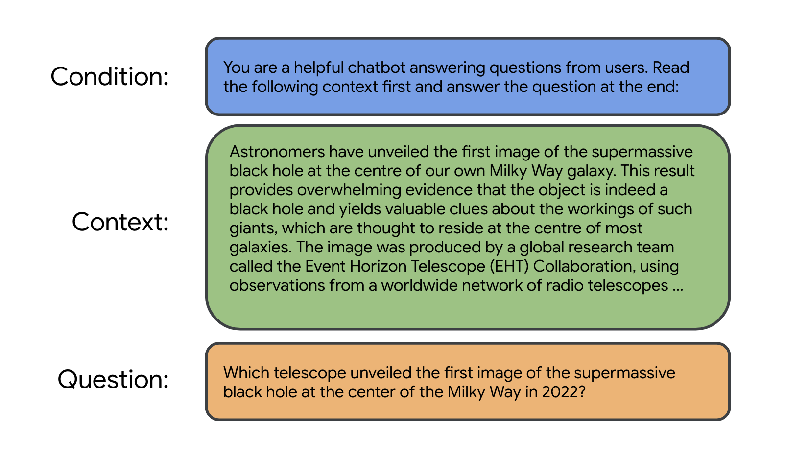

# Docs Agent concepts

**Note**: If you want to set up and launch the Docs Agent chat app on your host machine,
see the [Set up Docs Agent][set-up-docs-agent] section in README.

This page describes the architecture and features of Docs Agent.

## Overview

The Docs Agent chat app is designed to be easily set up and configured in a Linux environment.
and require that you have access to Google’s [Gemini API][genai-doc-site].

Docs Agent uses a technique known as Retrieval Augmented Generation (RAG), which allows
you to bring your own documents as knowledge sources to AI language models. This approach
helps the AI language models to generate relevant and accurate responses that are grounded
in the information that you provide and control.


**Figure 1**. Docs Agent uses a vector database to retrieve context for augmenting prompts.

## Main features

The key features of the Docs Agent chat app are:

- Add contextual information to user questions to augment prompts for AI language models.
- Process documents into embeddings and store them in a vector database for semnatic retrieval.


**Figure 2**. A user question is augmented by the Docs Agent server and passed to an LLM.

For the moment, the Docs Agent project focuses on providing Python scripts that make it
easy to process Markdown files into embeddings. However, there is no hard requirement that the
source documents must exist in Markdown format. What’s important is that the processed content
is available as embeddings in the vector database.

### Structure of a prompt to a language model

To enable an LLM to answer questions that are not part of the public knowledge (which the LLM
is likely trained on), the Docs Agent project applies a mixture of prompt engineering and
embeddings techniques. That is, we process a set of documents (which contain domain specific
knowledge) into embeddings and store them in a vector database. This vector database allows
the Docs Agent server to perform semantic search on stored embeddings to find the most relevant
content from the source documents given user questions.

Once the most relevant content is returned, the Docs Agent server uses the prompt structure
shown in Figure 3 to augment the user question with a preset **condition** and a list of
**context**. (When the Docs Agent server starts, the condition value is read from the
[`config.yaml`][config-yaml] file.) Then the Docs Agent server sends this prompt to a
language model using the Gemini API and receives a response generated by the model.



**Figure 3**. Prompt structure for augmenting a user question with related context
(Context source: [eventhorizontelescope.org][context-source-01])

### Processing of Markdown files into embeddings

To process information into embeddings using the Python scripts in the project, the
information needs to be stored in Markdown format. Once you have a set of Markdown files
stored in a directory on your host machine,  you can run the
[`files_to_plain_text.py`][files-to-plain-text] script to process those Markdown
files into small plain text files – the script splits the content by the top three Markdown
headers (`#`, `##`, and `###`).

Once Markdown files are processed into small plain text files, you can run the
[`populate_vector_database.py`][populate-vector-database] script to generate embeddings
for each text file and store those embeddings into a [Chroma][chroma-docs] vector database
running on the host machine.

The embeddings in this vector database enable the Docs Agent server to perform semantic search
and retrieve context related to user questions for augmenting prompts.

For more information on the processing of Markdown files, see the [`README`][scripts-readme]
file in the `scripts` directory.


**Figure 4**. A document is split into small semantic chunks, which are then used to generate
embeddings.


**Figure 5**. A Markdown page is split by headers and processed into embeddings.

## Summary of tasks and features

The following list summarizes the tasks and features of the Docs Agent chat app:

- **Process Markdown**: Split Markdown files into small plain text files. (See the
  Python scripts in the [`preprocess`][preprocess-dir] directory.)
- **Generate embeddings**: Use an embedding model to process small plain text files
  into embeddings, and store them in a vector database. (See the
  [`populate_vector_database.py`][populate-vector-database] script.)
- **Perform semantic search**: Compare embeddings in the vector database to retrieve
  most relevant content given user questions.
- **Add context to a user question**: Add a list of text chunks returned from
  a semantic search as context in a prompt.
- **Generate related questions**: In addition to displaying a response to the user
  question, the web UI displays 5 questions generated by the language model based on
  the context of the user question. (See the
  [Using a language model to suggest related questions][related-questions-section]
  section.)
- **Return URLs of documentation sources**: Docs Agent's vector database stores URLs
  as metadata next to embeddings. Whenever the vector database is used to retrieve
  text chunks for context, the database can also return the URLs of the sources used
  to generate the embeddings.
- **Collect feedback from users**: Docs Agent's chatbot web UI includes buttons that
  allow users to [like generated responses][like-generated-responses] or
  [submit rewrites][submit-a-rewrite].
- **Convert Google Docs, PDF, and Gmail into Markdown files**: This feature uses
  Apps Script to convert Google Docs, PDF, and Gmail into Markdown files, which then
  can be used as input datasets for Docs Agent. (See the
  [`apps_script`][apps-script-readme] directory.)
- **Run benchmark test to monitor the quality of AI-generated responses**: Using
  Docs Agent, you can run [benchmark test][benchmark-test] to measure and compare
  the quality of text chunks, embeddings, and AI-generated responses.
- **Use the Semantic Retrieval API and AQA model**: You can use Gemini's
  [Semantic Retrieval API][semantic-api] to upload source documents to an online
  corpus and use the [AQA model][aqa-model] that is specifically created for answering
  questions using an online corpus.

## Flow of events

The following events take place in the Docs Agent chat app:

1. The [`files_to_plain_text.py`][files-to-plain-text] script converts input
   Markdown documents into small plain text files, split by Markdown headings
   (`#`, `##`, and `###`).
2. The [`populate_vector_database.py`][populate-vector-database] script generates
   embeddings from the small plain text files and populates a vector database.
3. When the [`agent chatbot`] command is run, it starts the Docs Agent server and
   vector database, which loads generated embeddings and metadata (URLs and filenames)
   stored in the `vector_store` directory.
4. When the user asks a question, the Docs Agent server uses the vector database to
   perform semantic search on embeddings, which represent content in the source
   documents.
5. Using this semantic search capability, the Docs Agent server finds a list of
   text chunks that are most relevant to the user question.
6. The Docs Agent server adds this list of text chunks as context (plus a condition
   for responses) to the user question and constructs them into a prompt.
7. The system sends the prompt to a language model via the Gemini API.
8. The language model generates a response and the Docs Agent server renders it on
   the chat UI.

Additional events for
[suggesting 5 questions related to the user question][related-questions-section]:

9. The Docs Agent server prepares another prompt that asks the language model to
    generate 5 questions based on the context (in step 6).
10. The language model generates a response that contains a list of questions related
    to the context.
11. The Docs Agent server renders the questions on the chat UI.

## Supplementary features

This section describes additional features implemented on the Docs Agent chat app for
enhancing the usability of the Q&A experience powered by generative AI.


**Figure 6**. A screenshot of the Docs Agent chat UI showing the sections generated by
three distinct prompts.

### Using a language model to suggest related questions

The project‘s latest web UI includes the “Related questions” section, which displays five
questions that are related to the user question (see Figure 6). These five questions are also
generated by a language model (via the Gemini API). Using the list of contents returned from the vector
database as context, the system prepares another prompt asking the language model to generate five
questions from the included context.

The following is the exact structure of this prompt:

- Condition:

  ```
  Read the context below and answer the question at the end:
  ```

- Context:

  ```
  <CONTEXT_USED_IN_THE_PREVIOUS_PROMPT>
  ```

- Question:

  ```
  What are 5 questions developers might ask after reading the context?
  ```

### Enabling users to submit a rewrite of a generated response

The project‘s latest web UI includes the **Rewrite this response** button at the bottom of
the panel (see Figure 6). When this button is clicked, a widget opens up, expanding the
main UI panel, and reveals a textarea containing the generated response to the user's question.
The user is then allowed to edit this response in the textarea and click the **Submit** button
to submit the updated response to the system.

The system stores the submitted response as a Markdown file in the project's local `rewrites`
directory. The user may re-click the **Submit** button to update the submitted rewrite multiple
times.

### Enabling users to like generated responses

The project's latest web UI includes the **Like this response** button at the bottom of the panel
(see Figure 6). When this button is clicked, the server logs the event of "like" for the response.
However, clicking the **Liked** button again will reset the button. Then the server logs this reset
event of "like" for the response.

The user may click this like button multiple times to toggle the state of the like button. But when
examining the logs, only the final state of the like button will be considered for the response.

### Using Google Docs, PDF, or Gmail as input sources

The project includes Apps Script files that allow you to convert various sources of content
(including Google Docs and PDF) from your Google Drive and Gmail into Markdown files. You can then
use these Markdown files as additional input sources for Docs Agent. For more information, see the
[`README`][apps-script-readme] file in the `apps_script` directory.


**Figure 7**. Docs Agent's pre-processing flow for various doc types.

### Using the Semantic Retrieval API and AQA model

Docs Agent provides options to use Gemini's [Semantic Retrieval API][semantic-api] for storing text
chunks in Google Cloud's online storage (and using this online storage for context retrieval),
in combination with using the [AQA model][aqa-model] for question-answering.

To use the Semantic Retrieval API, update the `config.yaml` file to the following settings:

```
models:
  - language_model: "models/aqa"

...

db_type: "google_semantic_retriever"
```

The setup above uses both the Semantic Retrieval API and the AQA model.

**Note**: At the moment, when `db_type` is set to `google_semantic_retriever`, running the
`populate_vector_database.py` script will also create and popluate a local vector database using
Chroma as well as creating and populating an online corpus using the Semantic Retrieval API.

However, if you want to use only the AQA model without using an online corpus, update the
`config.yaml` file to the following settings instead:

```
models:
  - language_model: "models/aqa"

...

db_type: "chroma"
```

The setup above uses the AQA model with your local Chroma vector database. For more information,
see the [More Options: AQA Using Inline Passages][inline-passages] section on the
_Semantic Retriever Quickstart_ page.

**Note**: To use the Semantic Retrieval API, you need to complete the OAuth setup for your Google
Cloud project from your host machine. For detailed instructions, see the
[Authentication with OAuth quickstart][oauth-quickstart] page.

### Using Tools (MCP Integration)

Docs Agent integrates with external tools using the Model Command Platform
(MCP). This enables more complex and interactive workflows where the language
model can delegate specific tasks to specialized tools.

1. **Configuration**: You define available MCP tool servers in your
   [`config.yaml`][config-yaml] file under the `mcp_servers` key. Each entry
  specifies how Docs Agent connects to a tool server (currently `stdio` or
  `sse`).
2. **Tool Discovery**: When you run the `agent tools` command, Docs Agent
   connects to the configured MCP servers and discovers the available tools and
  their functions (including required parameters).
3.  **Function Calling**: This list of tools is provided to the Gemini model.
  When you provide a prompt (e.g., "Summarize recent changes in `main.py`"),
  the model can decide if executing one of the available tools would help
  fulfill the prompt. If so, it issues a *function call*.
4. **Execution**: Docs Agent intercepts this function call, executes the
   corresponding tool through the appropriate MCP server, and captures the result.
5. **Response Generation**: The tool's result is sent back to the Gemini model
  as context. The model then uses this result to generate the final response to
  your original prompt.

This mechanism allows Docs Agent to ground in real-time information or actions
performed by external tools brought up as MCP servers.

<!-- Reference links -->

[set-up-docs-agent]: ../README.md#set-up-docs-agent
[files-to-plain-text]: ../docs_agent/preprocess/files_to_plain_text.py
[populate-vector-database]: ../docs_agent/preprocess/populate_vector_database.py
[context-source-01]: http://eventhorizontelescope.org
[related-questions-section]: #using-a-language-model-to-suggest-related-questions
[submit-a-rewrite]: #enabling-users-to-submit-a-rewrite-of-a-generated-response
[like-generated-responses]: #enabling-users-to-like-generated-responses
[populate-db-steps]: #populate-a-new-vector-database-from-markdown-files
[genai-doc-site]: https://ai.google.dev/docs/gemini_api_overview
[chroma-docs]: https://docs.trychroma.com/
[apps-script-readme]: ../apps_script/README.md
[scripts-readme]: ../docs_agent/preprocess/README.md
[config-yaml]: ../config.yaml
[benchmark-test]: ../docs_agent/benchmarks/README.md
[semantic-api]: https://ai.google.dev/docs/semantic_retriever
[aqa-model]: https://ai.google.dev/models/gemini#model_variations
[oauth-quickstart]: https://ai.google.dev/docs/oauth_quickstart
[inline-passages]: https://ai.google.dev/docs/semantic_retriever#more_options_aqa_using_inline_passages
[authorize-credentials]: https://ai.google.dev/docs/oauth_quickstart#authorize-credentials
[preprocess-dir]: ../docs_agent/preproces/
