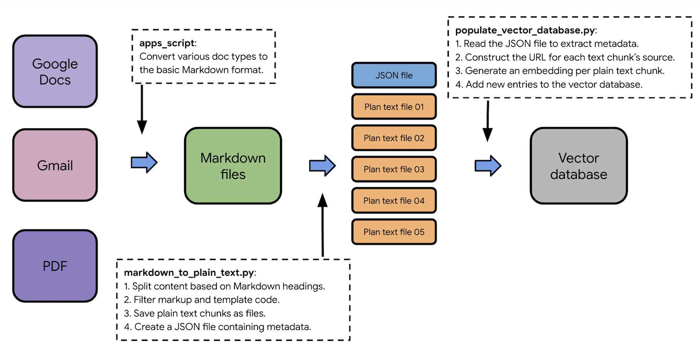

# Processing source documents in Docs Agent

This `README` file provides information on the steps involved in the following two Python scripts,
which are used to process source documents into plain text chunks and generate embeddings for
vector databases:

- [`files_to_plain_text.py`][files-to-plain-text]
- [`populate_vector_database.py`][populate-vector-database]



**Figure 1**. Docs Agent's pre-processing flow from source documents to the vector database.

**Note**: The `markdown_to_plain_text.py` script is deprecated in favor of
the `files_to_plain_text.py` script.

## Docs Agent chunking technique example

The [`files_to_plain_text.py`][files-to-plain-text] script splits documents
into smaller chunks based on Markdown headings (#, ##, and ###).

For example, consider the following Markdown page:

```
# Page title

This is the introduction paragraph of this page.

## Section 1

This is the paragraph of section 1.

### Sub-section 1.1

This is the paragraph of sub-section 1.1.

### Sub-section 1.2

This is the paragraph of sub-section 1.2.

## Section 2

This is the paragraph of section 2.
```

This example Markdown page is split into the following 5 chunks:

```
# Page title

This is the introduction paragraph of this page.
```

```
## Section 1

This is the paragraph of section 1.
```

```
### Sub-section 1.1

This is the paragraph of sub-section 1.1.
```

```
### Sub-section 1.2

This is the paragraph of sub-section 1.2.
```

```
## Section 2

This is the paragraph of section 2.
```

Additionally, becasue the token size limitation of embedding models, the script
recursively splits the chunks above until each chunk's size becomes less than
5000 bytes (characters).

## Steps in the files_to_plain_text.py script

In the default setting, when processing Markdown files to plain text using the
[`files_to_plain_text.py`][files-to-plain-text] script, the following events take place:

1. Read the configuration file ([`config.yaml`][config-yaml]) to identify input and output
   directories.
1. Construct an array of input sources (which are the `path` entries).
1. **For** each input source, do the following:
   1. Extract all input fields (`path`, `url_prefix`, and more).
   1. Call the `process_files_from_input()` method using these input fields.
   1. **For** each sub-path in the input directory and **for** each file in these directories:
      1. Check if the file extension is `.md` (that is, a Markdown file).
      1. Construct an output directory that preserves the path structure.
      1. Read the content of the Markdown file.
      1. Call the `process_page_and_section_titles()` method to reformat the page and section
         titles.
         1. Process Front Matter in Markdown.
         1. Detect (or construct) the title of the page.
         1. Detect Markdown headings (#, ##, and ###).
         1. Convert Markdown headings into plain English (to preserve context when generating
            embeddings).
      1. Call the `process_document_into_sections()` method to split the content into small
         text chunks.
         1. Create a new empty array.
         1. Divide the content using Markdown headings (#, ##, and ###).
         1. Insert each chunk into the array and simplify the heading to # (title).
         1. Return the array.
      1. **For** each text chunk, do the following:
         1. Call the `markdown_to_text()` method to clean up Markdown and HTML syntax.
            1. Remove `<!-- -->` lines in Markdown.
            1. Convert Markdown to HTML (which makes the plan text extraction easy).
            1. Use `BeautifulSoup` to extract plain text from the HTML.
            1. Remove `[][]` in Markdown.
            1. Remove `{: }` in Markdown.
            1. Remove `{. }` in Markdown.
            1. Remove a single line `sh` in Markdown.
            1. Remove code text and blocks.
            1. Return the plain text.
         1. Construct the text chunk’s metadata (including URL) for the `file_index.json` file.
         1. Write the text chunk into a file in the output directory.

## Steps in the populate_vector_database.py script

When processing plain text chunks to embeddings using the
[`populate_vector_database.py`][populate-vector-database] script, the following events take place:

1. Read the configuration file ([`config.yaml`][config-yaml]) to identify the plain text directory
   and Chroma settings.
1. Set up the Gemini API environment.
1. Select the embeddings model.
1. Configure the embedding function (including the API call limit).
1. **For** each sub-path in the plain text directory and **for** each file in these directories:
   1. Check if the file extension is `.md` (that is, a Markdown file).
   1. Read the content of the Markdown file.
   1. Construct the URL of the text chunk’s source.
   1. Read the metadata associated with the text chunk file.
   1. Store the text chunk and metabase to the vector database, which also generates an embedding
      for the text chunk at the time of insertion.
   1. Skip if the file size is larger than 5000 bytes (due to the API limit).
   1. Skip if the text chunk is already in the vector database and the checksum hasn’t changed.

### Delete chunks process

The process below describes how the delete chunks feature is implemented in the
`populate_vector_database.py` script:

1. Read all exiting entries in the target database.
2. Read all candidate entries in the `file_index.json` file (created after running the
   `agent chunk` command).
3. For each entry in the existing entries found in step 1:

   Compare the `text_chunk_filename` fields (included in the entry's `metadata`).

   1. If not found in the candidate entires in step 2, delete this entry in the database.

   1. If found, compare  the `md_hash` fields:

      If they are different, delete this entry in the database.

<!-- Reference links -->

[files-to-plain-text]: files_to_plain_text.py
[populate-vector-database]: populate_vector_database.py
[config-yaml]: ../../config.yaml
